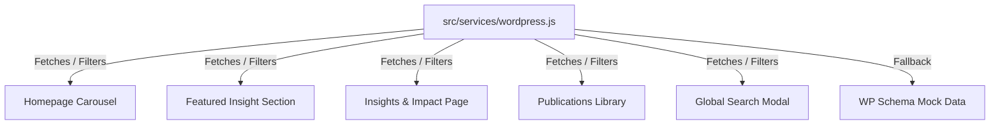

# Implementation Plan - Headless WordPress Integration

We will implement a complete, premium **Headless WordPress REST API Integration** for **Beyond#**. WordPress will act as the content management backend, and the React/Tailwind frontend will dynamically consume this content. Since a live WordPress instance is not pre-configured, we will write a robust API service layer in `src/services/wordpress.js` that points to real WP REST API endpoints and automatically falls back to structured, local-cache-enabled mock responses mirroring the official WordPress JSON schema.

---

## User Review Required

> [!IMPORTANT]
> - **WordPress JSON Schema Compatibility**: Our service layer will query standard endpoints (`/wp-json/wp/v2/posts`, `/wp-json/wp/v2/publications`, `/wp-json/wp/v2/projects`, `/wp-json/wp/v2/media`). The mock fallback data will strictly mirror the standard WP schema:
>   - Text fields in `title.rendered`, `content.rendered`, `excerpt.rendered`.
>   - Dates in standard ISO format (`date`).
>   - Custom fields mapped inside standard `acf` or custom properties (e.g., `acf.featured_status`, `acf.download_attachment`, `acf.pdf_upload`).
>   - Media linked through `_embedded['wp:featuredmedia']` or custom media URIs.
> - **WordPress Configuration Hook**: We will export a configurable API base URL (`WP_API_URL` in `src/services/wordpress.js`). Administrators can replace this URL with their live WordPress domain to immediately switch from mock to live content.
> - **Global Search Overlay**: We will introduce a premium global search box in the header (or as a toggle modal) that searches across articles, publications, and projects in real time.

---

## Proposed Changes

We will create a service layer and modify key page templates.

### 1. WordPress Service Layer

#### [NEW] [wordpress.js](file:///C:/Users/rilwan.usman.NRS/.gemini/antigravity/scratch/src/services/wordpress.js)
We will create a service that exposes the following functions:
- `fetchArticles()`: Returns articles with fields mapped from standard post endpoints, handling category filtering, pagination (12 per page), and searching.
- `fetchPublications()`: Returns reports, situation sheets, briefs with PDF download attachments.
- `fetchProjects()`: Returns community engagement dialogues, locations, coordinates, and statistics.
- `globalSearch(query)`: Queries all three endpoints in parallel and pools results.
- `getRelatedArticles(currentArticleId, category, tags)`: Finds 3 related articles based on category/tag proximity.
*Features*: 
- Memory caching to prevent redundant HTTP requests.
- Automatic fallback to high-fidelity mock databases if the live API requests fail (e.g., net errors, timeout).
- Simulated delay (600ms) on mock requests to display premium skeletal loading animations.

---

### 2. Homepage & Carousel Integrations

#### [MODIFY] [App.jsx](file:///C:/Users/rilwan.usman.NRS/.gemini/antigravity/scratch/src/App.jsx)
- **Featured Insight logic**: Query articles and display the most recent article marked `acf.featured_status === true`. If none exist, fall back to the most recent published article.
- **Dynamic News Carousel**: Update `InsightImpactNewsSection` to dynamically query the latest 5 articles from the WP API service, showing loading skeletons and updating on mount.
- **Global Search UI**: Implement a toggleable search button and overlay modal in the main layout (linked to `globalSearch` API).

---

### 3. Insights & Impact Page Redesign

#### [MODIFY] [App.jsx](file:///C:/Users/rilwan.usman.NRS/.gemini/antigravity/scratch/src/App.jsx) (ImpactPage)
- Integrate the WP API fetching into `ImpactPage`.
- Implement an interactive Search bar, Category Filter buttons (Human Security Monitor, Research Brief, Policy Insight, etc.), Sort dropdown (Newest, Oldest, Most Viewed), and Pagination controls (12 posts per page).
- Connect cards to open a detailed **Article Reader Modal** which displays full content, author, focus states, and the **3 Related Articles Engine** at the bottom.

---

### 4. Publications Library Integration

#### [MODIFY] [App.jsx](file:///C:/Users/rilwan.usman.NRS/.gemini/antigravity/scratch/src/App.jsx) (ResearchPage)
- Embed an interactive **Publications Library** block beneath the thematic area list.
- Allow visitors to filter by: Year, Publication Type (Annual, Research, Situation, Brief), Topic, State Coverage, and Keywords.
- Render publication cards with covers, year stamps, summaries, download buttons, and a download counter that increments on click.

---

## Verification Plan

### Automated Checks
- Run `npm run build` to confirm compiler compatibility.

### Manual Verification
1. Open the homepage: Verify the Carousel lists 5 dynamic posts and updates immediately.
2. Verify the Featured Insight card pulls the marked post correctly.
3. Open the Insights & Impact page: 
   - Verify that typing in the search box filters items.
   - Click category filter tags and verify results filter.
   - Change the Sort selector and check ordering.
   - Verify pagination hides/shows items in grids of 12.
4. Open the Publications Library: Verify filters by Year, Type, and Topic work in unison.
5. Click a download button: Verify the progress modal fires and increments the download counter in local state.
6. Trigger the Global Search in the header, search for "Kaduna" or "Observatory", and check that matching articles, publications, and projects are returned in segmented grids.
